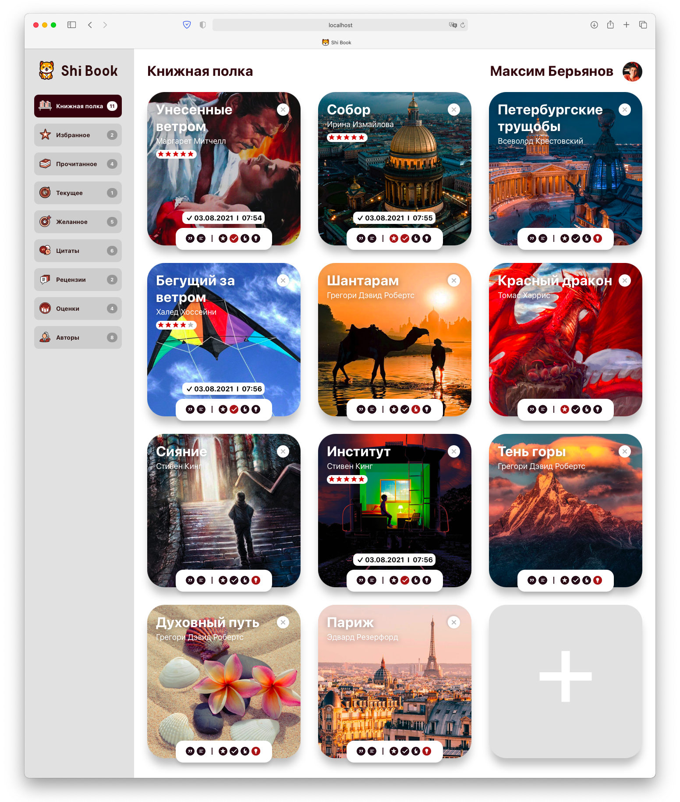

# Shi Book
#### Модуль на React.js, позволяющий имитировать книжную библиотеку. Здесь Вы можете добавлять вниги, обложку к ним, выкладывать рецензии и цитаты, а также менять состояния книг и добавлять их в избранное. 

## Главный экран

#### Здесь расположен список всех доступных книг с возможностью добавления новой и взаимодействия с текущими.

## Экран с расширенной информацией по книге

#### Открывается при нажатии на обложку книги. Здесь Вы можете изменить цитаты и рецензии, а также просмотреть дату их создания / последнего обновления.  

## Экран с добавленными рецензиями

#### Здесь размещаются все доступные рецензии с возможностью их редактирования.

## Экран с добавленными цитатами

#### Здесь размещаются все доступные цитаты с возможностью их редактирования.

## Взаимодействие с книгой

#### На каждой книге имеется бар с кнопками управления. Слева-направо: кнопка с добавлением цитаты, кнопка с добавлением рецензии, кнопка с помещением книги в избранное, кнопка с изменением состояния книги на прочитанное, кнопка с изменением состояния книги на текущее, кнопка с изменением состояния книги на желанное. Имеется возможность удалить книгу.

## Демо (YouTube)
https://www.youtube.com/watch?v=G4fg3KUWvnY

## Демо (GIF)

